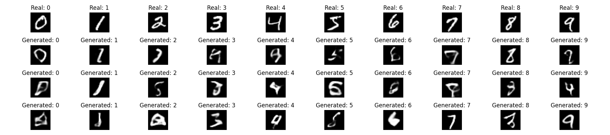

# 🖼️ C-VAE MNIST

This project trains a **Conditional Variational Autoencoder (CVAE)** to generate handwritten digits from the MNIST dataset (images of 0–9).
You’ll learn how to prepare the data, train the model, create new digits, and keep track of your experiments.

---

## 🤔 What’s a CVAE?

* A **Variational Autoencoder (VAE)** is a type of neural network that learns to compress data into a smaller space (latent space) and then reconstruct it.
* A **Conditional VAE (CVAE)** goes one step further: it lets you **control what gets generated**.

  * Example: you can ask it to generate the digit *“6”* instead of random digits.

---

## 📊 Why MLflow?

* MLflow is a tool that **keeps track of your experiments**.
* Every time you train, it saves the parameters you used, results, and models, so you don’t lose track.
* By default, it works locally. You can also run it on a server with Docker.

---

## 🛠️ What You Need

* **Python 3.10**
* [Poetry](https://python-poetry.org/)
* Git
* *(Optional)* GPU (for faster training)

---

## 📦 Install the Project

```bash
git clone https://github.com/moreira-and/cvae-mnist.git && cd cvae-mnist
poetry build
poetry install
poetry shell   # optional
```

---

## 🚀 How to Run It

### 1. Prepare the dataset (CLI)

```bash
poetry run dataset
# saves tensors under data/processed/
```

### 2. Train the model (CLI)

```bash
poetry run train
# common flags: --latent_dim 20 --num_epochs 10 --batch_size 128 --lr 0.001
```

### 3. Generate a digit (example: “6”)

```bash
poetry run gen --digit 6
# writes reports/figures/cvae_digit6.png
```

### 4. Plot comparison grid (CLI)

```bash
poetry run plot
# writes reports/figures/cvae_comparison.png
```

### 5. End-to-end experiment (CLI)

```bash
poetry run experiment --do-data --do-train --do-plots
# use --no-do-data / --no-do-train / --no-do-plots to skip steps
```

### 6. Try the Jupyter notebook


- Open [notebooks/quick_start.ipynb](notebooks/quick_start.ipynb) and Run All.

---

## 📂 Where Things Are Saved

* `data/processed/` → dataset files (train/test splits)
* `models/` → saved models (`model.pth`, `decoder.pth`)
* `reports/figures/` → generated images (e.g., `cvae_digit6.png`)
* `mlruns/` → logs of your training runs (for MLflow)

---

## ⚙️ Settings

* `params.yaml` → main settings like batch size, epochs, latent dimension
* `src/cvae/config.py` → connects everything and points MLflow to the right place

---

## 📊 Using MLflow

### Local (default)

```bash
poetry run mlflow ui --backend-store-uri mlruns --host 0.0.0.0 --port 5000
```

Open: [http://localhost:5000](http://localhost:5000)

---

## CLI Reference

- `dataset` — downloads and preprocesses MNIST into `data/processed/`.
- `train` — trains the CVAE. Flags: `--latent_dim`, `--num_epochs`, `--batch_size`, `--test_batch_size`, `--lr`, `--momentum`, `--seed`.
- `gen` — generates a digit image. Flag: `--digit|-d` (0–9). Outputs to `reports/figures/cvae_digit{d}.png`.
- `plot` — creates comparison grid at `reports/figures/cvae_comparison.png`.
- `experiment` — runs `dataset` → `train` → `plot`. Flags: `--do-data/--no-do-data`, `--do-train/--no-do-train`, `--do-plots/--no-do-plots`.
### Training with custom settings

```bash
poetry run train --latent_dim 100 --num_epochs 10 --batch_size 128 --lr 0.001
```

### Generate digit “7”

```bash
poetry run gen --digit 7
# creates → reports/figures/cvae_digit7.png
```

---

## 📸 Results

After training, the CVAE can generate digits conditioned on the number you choose.

Here are examples of generated digits (y = 0–9):



> Tip: If you don’t see results like this right away, try training for more epochs (e.g., `--num_epochs 20`) or increasing the latent dimension in [paramns.yaml](params.yaml).

---

## 📁 Project Layout

```
cvae-mnist/
  - src/
    - cvae/
      - __main__.py        # enables `python -m cvae` (help)
      - cli.py             # console entrypoints wrappers
      - config.py          # paths, mlflow, device, params
      - api.py             # optional FastAPI service
      - service/
        - dataset.py       # dataset preparation
        - train.py         # training loop
        - gen.py           # inference / image generation
        - plots.py         # visualization utilities
        - utils.py         # data loader, loss, save_model
        - models/
          - nn_cvae.py
          - conditional_encoder.py
          - conditional_decoder.py
  - notebooks/
    - quick_start.ipynb
  - models/              # saved weights (.pth)
    - model.pth
    - decoder.pth
  - reports/
    - figures/
      - cvae_comparison.png
      - cvae_digit5.png
      - cvae_digit6.png
      - cvae_digit7.png
  - params.yaml
  - Makefile
  - pyproject.toml
  - setup.cfg
  - poetry.lock
  - LICENSE
  - README.md
```

---

## 🔨 Shortcuts (Makefile)

* `make data` → download MNIST
* `make requirements` → install dependencies
* `make lint` → check code style
* `make format` → auto-format code
* `make test` → run tests (if any)

---

## 📜 License

MIT (see [LICENSE](LICENSE))


